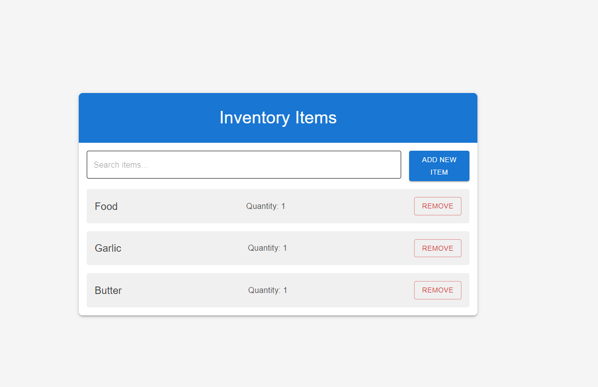
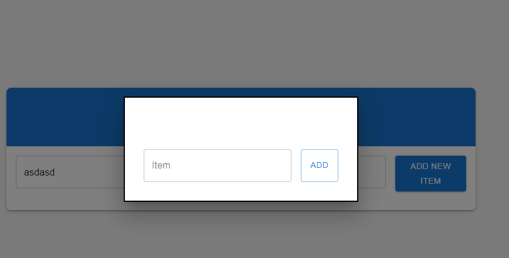

# Pantry Inventory Manager

## Overview
This Next.js application provides a simple and intuitive interface for managing a pantry inventory. Users can add, remove, and search for items in their inventory.

## Features
- Add new items to the inventory
- Remove items or decrease their quantity
- Search functionality to quickly find items
- Real-time updates with Firebase Firestore backend

## Technology Stack
- Next.js
- React
- Material-UI for styling
- Firebase Firestore for data storage

## Getting Started
1. Clone the repository
2. Install dependencies: `npm install`
3. Set up your Firebase configuration
4. Run the development server: `npm run dev`

## Usage
- Click "Add New Item" to add items to your inventory
- Use the search bar to filter items
- Click "Remove" to decrease an item's quantity or remove it entirely

## Screenshots

## Note
This application uses client-side rendering and optimistic updates for a smooth user experience.